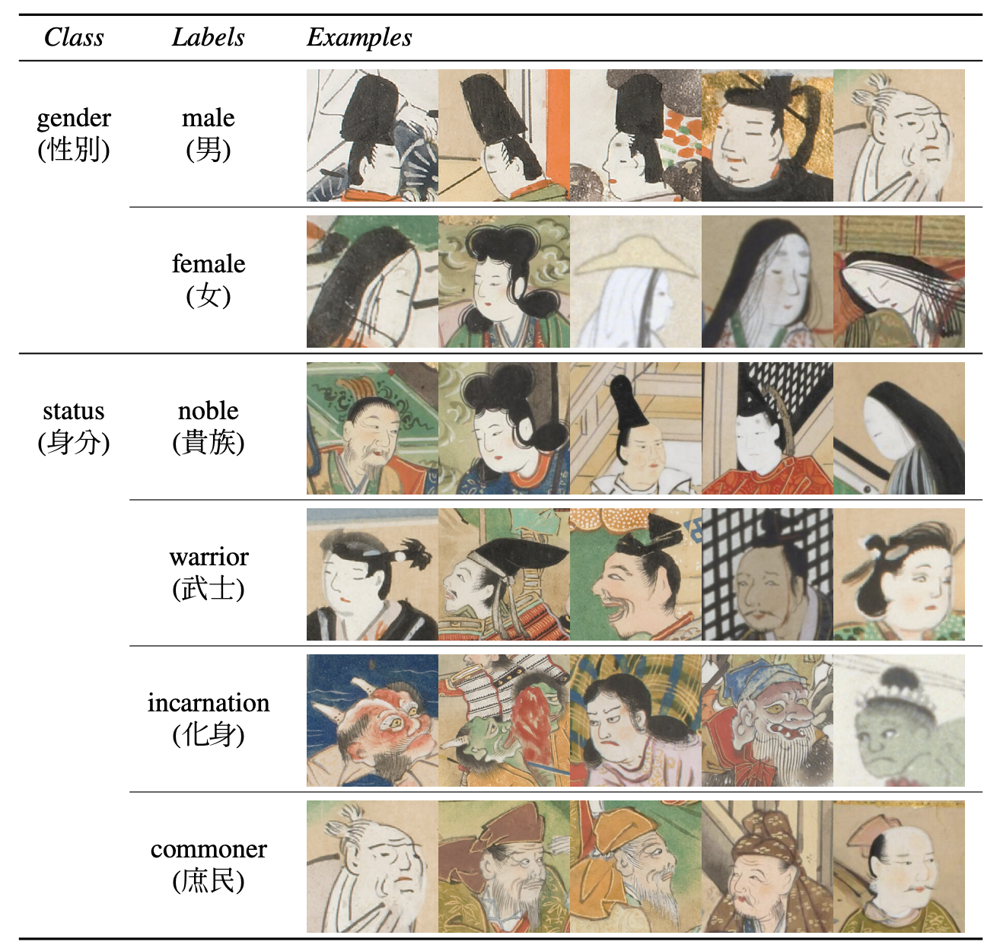

# KaoKore Dataset

[](https://creativecommons.org/licenses/by-sa/4.0/)  


📚 [Read the paper](https://arxiv.org/abs/2002.08595) to learn more about Kaokore dataset, our motivations in making them, as well as creativity usage of it!

## The Dataset

_KaoKore_ is a novel dataset of face images from Japanese illustrations along with multiple labels for each face, derived from the [_Collections of Facial Expressions_](http://codh.rois.ac.jp/face/). 

_KaoKore_ dataset is build based on the [_Collections of Facial Expressions_](http://codh.rois.ac.jp/face/), which  results from an effort by the ROIS-DS Center for Open Data in the Humanities (CODH) that has been publicly available since 2018. 
It provides a dataset of cropped face images extracted from Japanese artworks publicly available from National Institute of Japanese Literature, Kyoto University Rare Materials Digital Archive and Keio University Media Center from the Late Muromachi Period (16th century) to the Early Edo Period (17th century) to facilitate research into art history, especially the study of artistic style. It also provides corresponding metadata annotated by researchers with domain expertise.

KaoKore dataset contains 5552 image files, each being an color (RGB) image of size 256 x 256 as well as two sets of labels _gender_ and _social status_.. 

<p align="center">
  

  <br>
  Example of the <em>KaoKore</em> dataset, showing various faces in diverse yet coherent artisticstyles.
</p>

<p align="center">
  
  
  <br>
  Labels (labels.csv) available in the dataset along with exemplary images belonging to each labels.
</p>


## Get the data 💾

🌟 You can run [`python3 download.py`](download.py) download KaoKore datasets.
See the output of `download.py --help` for more details.

It is known that some conda installations may have trouble looking for SSL certificates. If that is the case, you could use `download.py --ssl_unverified_context`, **at your own risk and only if you know what you are doing**, to disable the certificate verification.

### The Data Loaders

Data loaders for _Pytorch_ and _TensorFlow_ are available in code folder.

## Benchmarks & Results 📈
We provide quantitative resultson the supervised machine learning tasks of gender and social status prediction from KaoKore images. (Keras classification code is available in code folder)

Have more results to add to the table? Feel free to submit an [issue](https://github.com/rois-codh/kaokore/issues/new) or [pull request](https://github.com/rois-codh/kaokore/compare)! (update the link****)

|Model                            | Gender| Status | Credit
|---------------------------------|-------|--------|-----|
|VGG11    |92.03% | 78.74% | [alantian](https://github.com/alantian) |
|AlexNet    |91.27% | 78.93% | [alantian](https://github.com/alantian) |
|ResNet-18    |92.98% | 82.16% | [alantian](https://github.com/alantian) |
|ResNet-34    |93.55% | 84.82% | [alantian](https://github.com/alantian) |
|MobileNet-v2    |95.06% | 82.35% | [alantian](https://github.com/alantian) |
|DenseNet-121   |94.31% | 79.70% | [alantian](https://github.com/alantian) |
|Inception-v3    |96.58% | 84.25% | [alantian](https://github.com/alantian) |

## Generative Models Demo Videos
Please download generative model demo video from here.
[Learning to painting](http://codh.rois.ac.jp/face/dataset/demo/learning-to-painting_drawings.zip)
[Intrinsic style transfer drawing](http://codh.rois.ac.jp/face/dataset/demo/intrinsic-style-transfer_drawings.zip)


## Citing KaoKore dataset
If you use any of the Kaokore datasets in your work, we would appreciate a reference to our paper:

**KaoKore dataset etc. Yingtao Tian et al. [arXiv:2002.08595](https://arxiv.org/abs/2002.08595)** update the link

```latex
@misc{tian2020kaokore,
    title={KaoKore: A Pre-modern Japanese Art Facial Expression Dataset},
    author={Yingtao Tian and Chikahiko Suzuki and Tarin Clanuwat and Mikel Bober-Irizar and Alex Lamb and Asanobu Kitamoto},
    year={2020},
    eprint={2002.08595},
    archivePrefix={arXiv},
    primaryClass={cs.CV}
}
```

## License

Both the dataset itself and the contents of this repo are licensed under a permissive  [CC BY-SA 4.0](https://creativecommons.org/licenses/by-sa/4.0/) license, except where specified within some benchmark scripts. CC BY-SA 4.0 license requires attribution, and we would suggest to use the following attribution to the KaoKore dataset.

"KaoKore Dataset" (created by CODH), adapted from "etc" 
(created by NIJL and others), doi:10.20676/00000353
